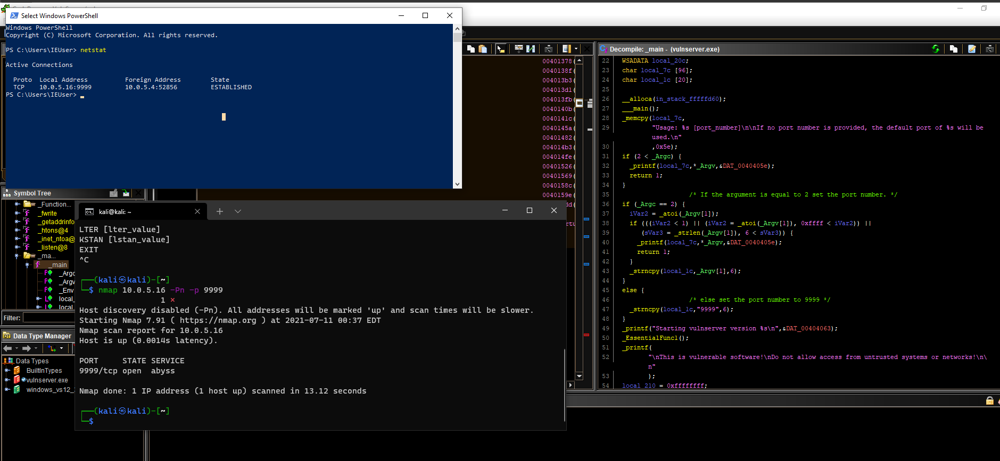
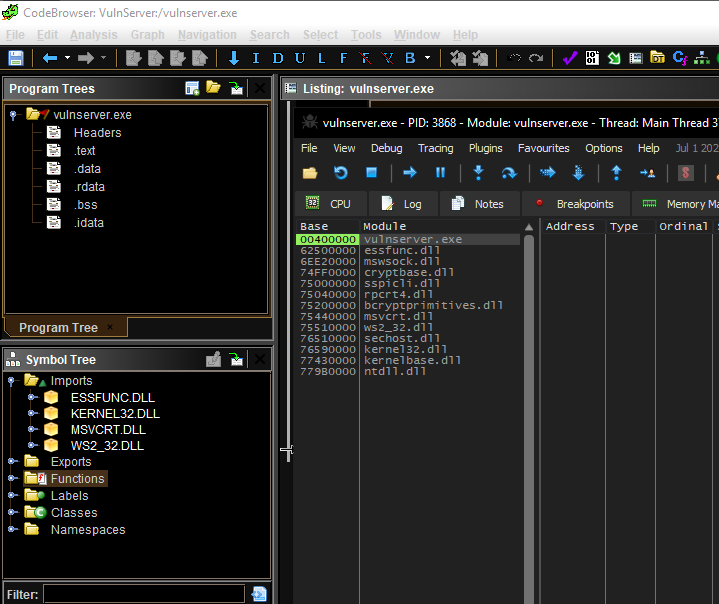

# VulnServer

# Tools:
* Spike
* Ghidra
* x64 Debbugger

# Lessons
Make sure the Fuzzer has the right parameters. I could not crash the program via spike until I reviewed the links:  [SAMS](https://samsclass.info/127/proj/p16-spike.htm) [INFOSEC](https://resources.infosecinstitute.com/topic/intro-to-fuzzing/)

# Network Analysis:
VulnServer is known to be vulnerable. While the source code is available to view, I wanted to learn Ghidra and reverse engineering concepts.
The first step was running the program. Fortunately VulnServer had console output.
In the event that this application did not reveal which port number the server is running(no arg supplied) there are a couple of options.
* NetStat
* WireShark
* NMAP
* Ghidra(disassemble the file and see if there's a string/number) 

  A Reverse Engineer can view a programs imports and see if networking libraries are used. According to MSDN "The Ws2_32.dll loads the service provider's interface DLL into the system...This is typically triggered by an application calling either socket or WSASocket to create a new socket" This indicates that sockets may be used. The mswsock library was also used(dynamically). Mswsock = Windows Sockets 2.

# Fuzzing:
I am testing two commands that cause VulnServer to crash TRUN & KSTET.  I haven't fuzzed other commands. 
I learned TRUN from CNIT 127 and KSTET from a Udemy course(I will link both).

# Binary Analysis:
Lets say VulnServer crashes why did it crash and is the crash exploitable?